# BrainTech: A QuizApp-IOS

## Project Description

This application tests a user's knowledge in modern software technology through trivia.

## Technologies Used

1. XCode 12 - IDE
2. Swift 5 - Programming Language
3. SQLite - Database
4. iOS 14.4 - IOS Version

## Features

1. Facebook Login
2. User Notification
3. Timers
4. Speech Recognition
5. SQLite CRUD Implementation

## Getting Started

##### NOTE: This assumes you have XCode 12+ installed.

1. Clone the project: 
    - ```git clone https://github.com/sfrazier851/QuizApp-IOS.git```

2. Open cloned QuizApp-IOS folder and double click:
    - ```QuizApp-IOS.xcodeproj```

3. Set Simulator to "iPhone 11" and click Play/Run button.

     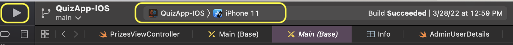
    
## Screenshots

###### AppIcon


###### Logo:


###### Launch, Initial, SignUp, Login, Facebook Login

<p float="left">
<kbd>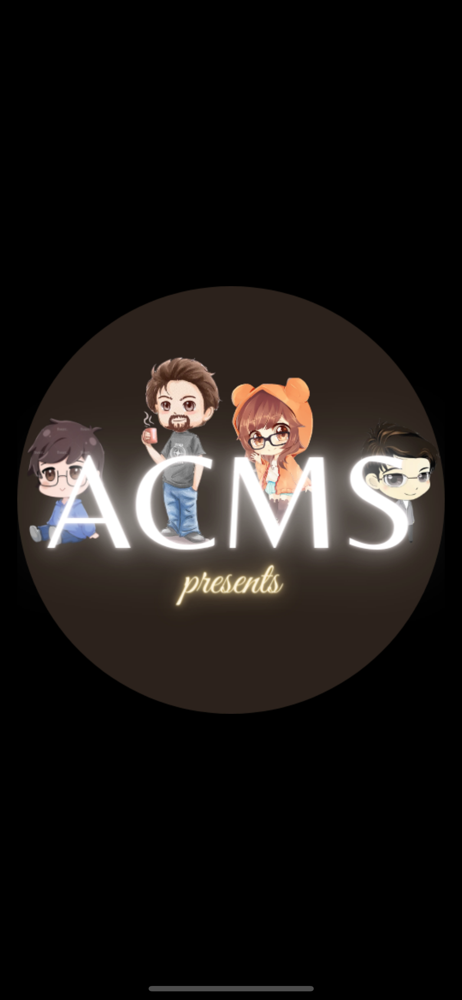</kbd>
<kbd>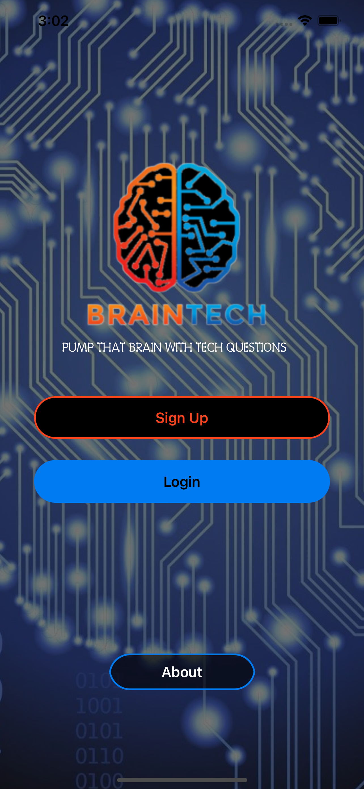</kbd>
<kbd>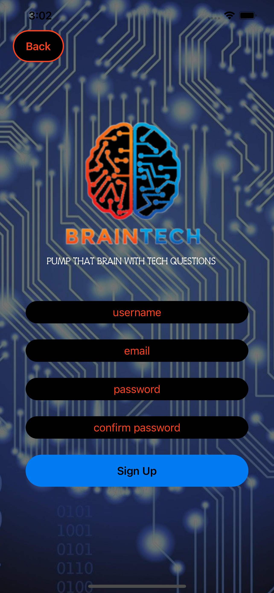</kbd>
<kbd>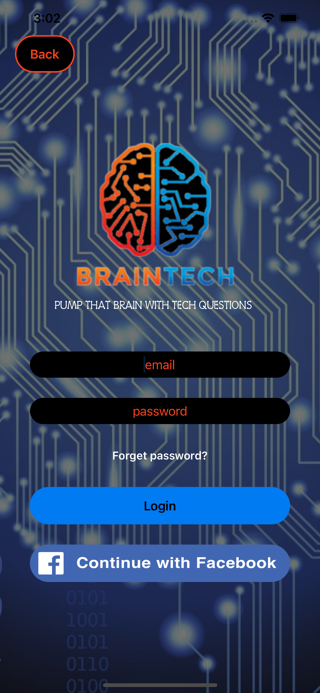</kbd>
<kbd>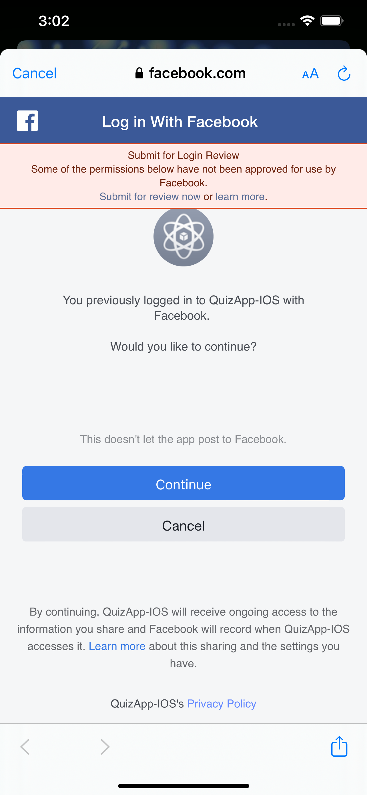</kbd>
</p>

###### Home (Free Account), Home (Paid Subscription), Leaderboards, App Feedback 

<p float="left">
<kbd>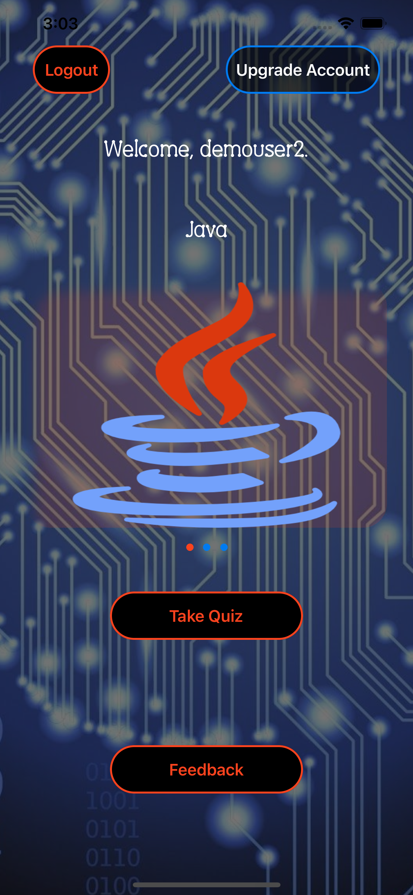</kbd>
<kbd>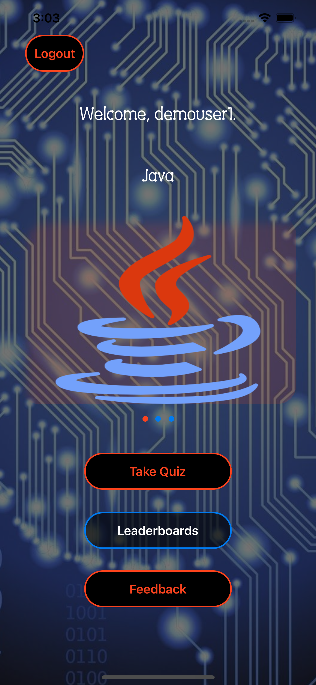</kbd>
<kbd>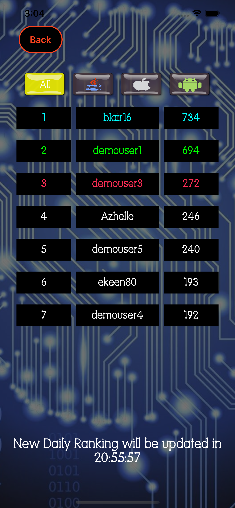</kbd>
<kbd>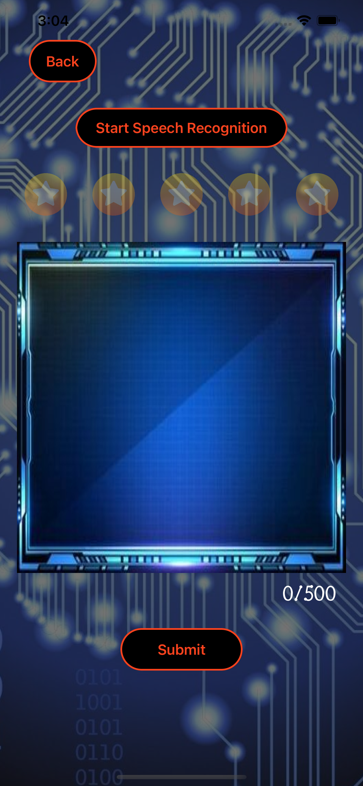</kbd>
</p>

###### Java Quiz, iOS Quiz, Android Quiz, Game Over, Game Over Leaderboard

<p float="left">
<kbd></kbd>
<kbd>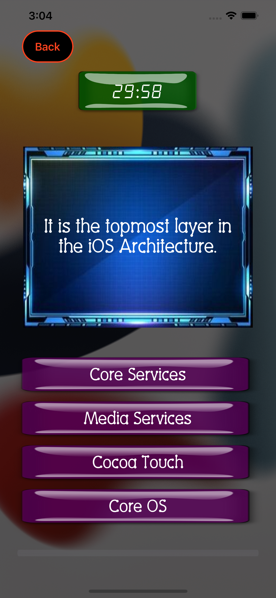</kbd>
<kbd>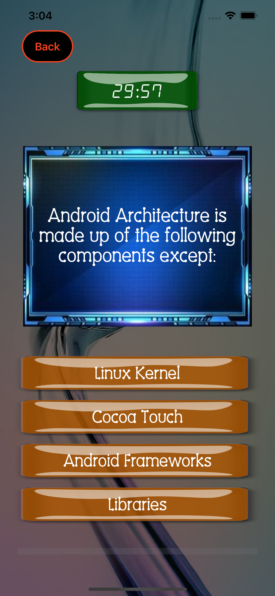</kbd>
<kbd>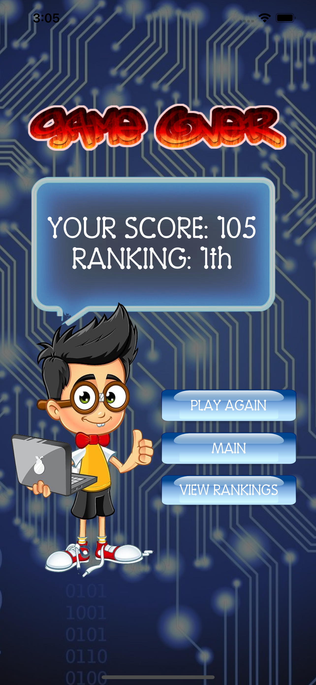</kbd>
<kbd></kbd>
</p>

###### Admin Manage Users, Admin Create a Quiz

<p float="left">
<kbd>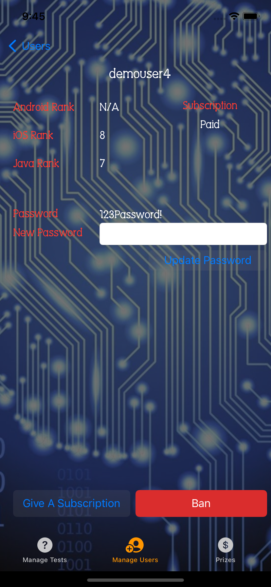</kbd>
<kbd></kbd>
<kbd></kbd>
</p>

###### About

<kbd></kbd>

## Contributors

<a href="https://github.com/azhelle16" title="Click for Github Portfolio">***Maricel Louise Sumulong***</a>

<a href="https://github.com/sfrazier851" title="Click for Github Portfolio">***Spencer Frazier***</a>

<a href="https://github.com/malmsteadaa" title="Click for Github Portfolio">***Andrew Malmstead***</a>

<a href="https://github.com/Chibi310" title="Click for Github Portfolio">***Christopher Medina***</a>

## Note
This is a group project under the supervision of Ms. Asha Rani. If you find your icons in this application, please e-mail me at mllsumulong@gmail.com for proper attribution.

Icons: 

***https://www.flaticon.com/authors/freepik***

***Main Logo:***

<a href="https://www.vectorstock.com/royalty-free-vector/brain-tech-logo-design-template-vector-31362674">Vector image by VectorStock / vectorstock</a>

Quizzes:

***Android***

* https://www.guru99.com/android-interview-questions.html

***Java***

* https://www.simplilearn.com/tutorials/java-tutorial/java-interview-questions
* Revature's OOP Study Guide

***IOS***

* https://www.softwaretestinghelp.com/swift-interview-questions/
* Revature's IOS Curriculum

