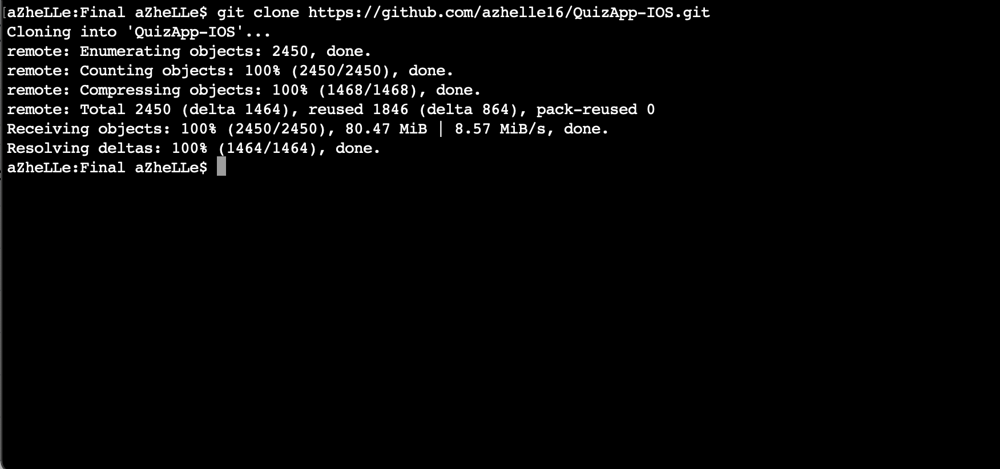
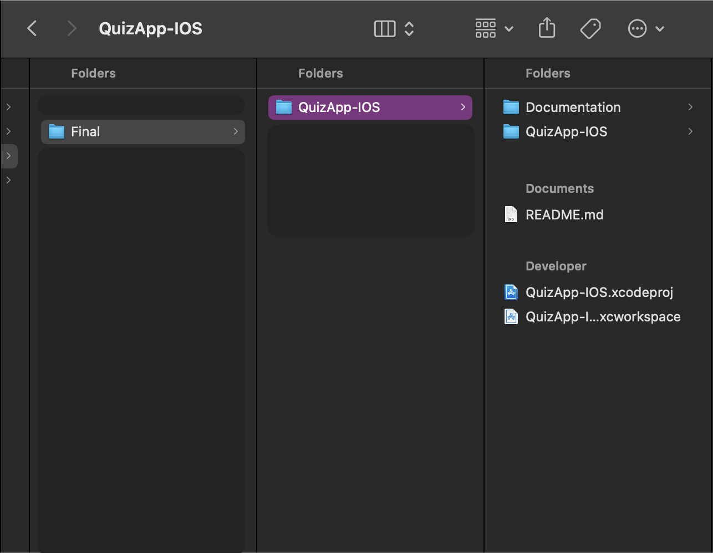
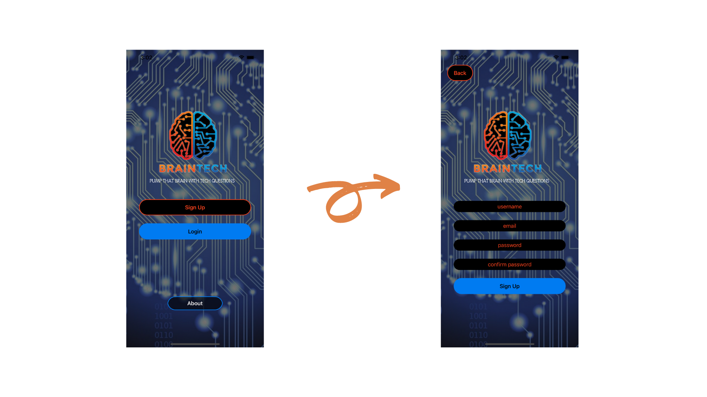
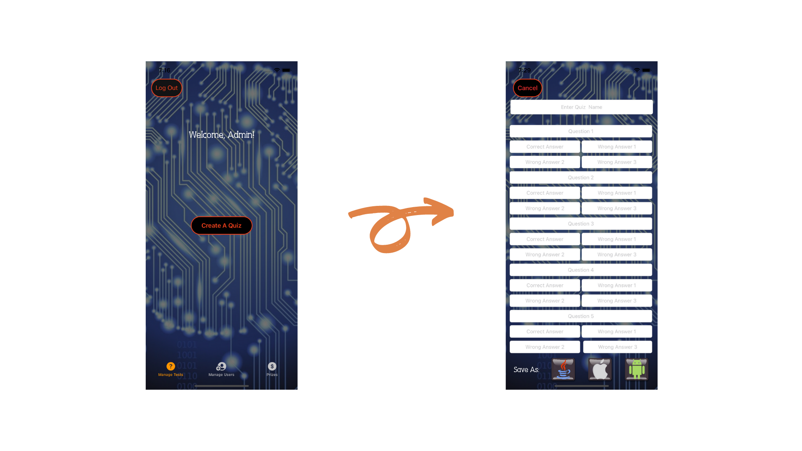
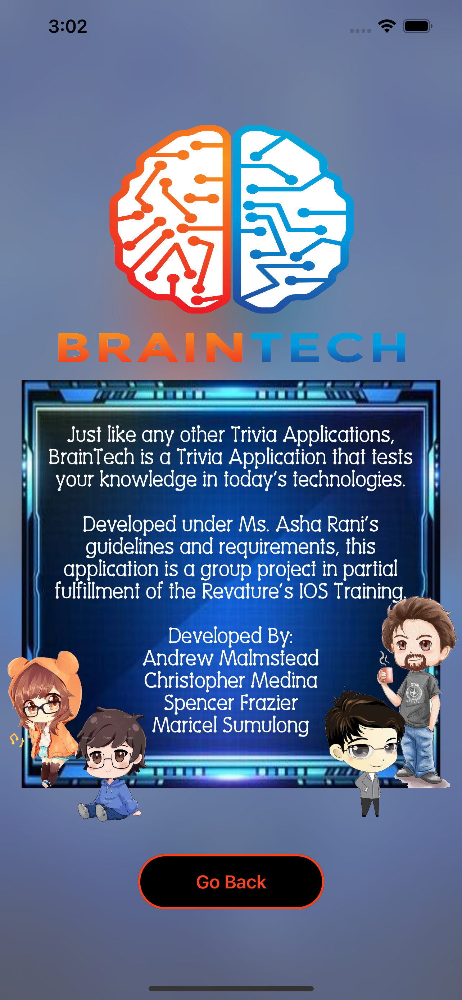

# BrainTech: A QuizApp-IOS

## Project Description

This project is a single base application that lets a user tests his knowledge in today's technology through Trivia.

## Technologies Used

1. XCode 12 - IDE
2. Swift 5 - Programming Language
3. SQLite - Database
4. iOS 14.4 - IOS Version

## Features

1. Facebook Login
2. User Notification
3. Timers
4. Speech Recognition
5. SQLite CRUD Implementation

## Getting Started

1. All we need to do is to clone the project into your desired folder using the following command: ***git clone https://github.com/azhelle16/QuizApp-IOS.git***.

2. Once cloning is done, switch to the QuizApp-IOS folder and click on ***QuizApp-IOS.xcodeproj***

3. Select "iPhone 11" as your simulator and click the Play button to start the application.

4. Voila, you can now start signing-up to play around with the application

    
## Usage

Below are screenshots of the project in action:

1. LaunchScreen Page

2. Welcome Page

3. Sign-Up Page

4. Login Page

5. Login via Facebook

6. Home Page For Players with Free Account

7. Home Page For Players with Paid Account

8.  Java Gameplay

9.  IOS Gameplay

10.  Android Gameplay

11.  Game Over Page

12.  Leaderboard On Home Page

13.  Leaderboard On Game Over Page

14.  Feedback Page

15. Admin: Create A Quiz

16. Admin: Manage Users

17. About Page

## Contributors

<a href="https://github.com/azhelle16" title="Click for Github Portfolio">***Maricel Louise Sumulong***</a>

<a href="https://github.com/sfrazier851" title="Click for Github Portfolio">***Spencer Frazier***</a>

<a href="https://github.com/malmsteadaa" title="Click for Github Portfolio">***Andrew Malmstead***</a>

<a href="https://github.com/Chibi310" title="Click for Github Portfolio">***Christopher Medina***</a>

## Note
This is a group project under the supervision of Ms. Asha Rani. If you find your icons in this application, please e-mail me at mllsumulong@gmail.com for proper attribution.

Icons: 

***https://www.flaticon.com/authors/freepik***

***Main Logo:***

<a href="https://www.vectorstock.com/royalty-free-vector/brain-tech-logo-design-template-vector-31362674">Vector image by VectorStock / vectorstock</a>

Quizzes:

***Android***

* https://www.guru99.com/android-interview-questions.html

***Java***

* https://www.simplilearn.com/tutorials/java-tutorial/java-interview-questions
* Revature's OOP Study Guide

***IOS***

* https://www.softwaretestinghelp.com/swift-interview-questions/
* Revature's IOS Curriculum

